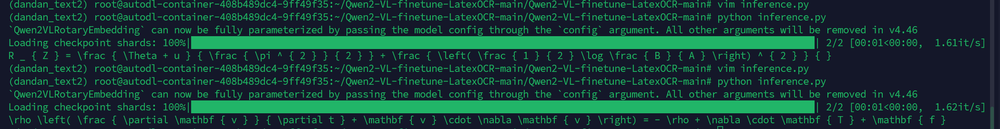

# 基于Qwen2-VL微调实战：LaTex公式OCR识别任务

  - [背景](#背景)
  - [环境配置](#环境配置)
  - [准备数据集](#准备数据集)
  - [模型下载与加载](#模型下载与加载)
  - [集成SwanLab](#集成swanlab)
  - [开始微调](#开始微调)
  - [训练结果演示](#训练结果演示)
  - [推理LoRA微调后的模型](#推理lora微调后的模型)


## 背景

[Qwen2-VL](https://link.zhihu.com/?target=https%3A//modelscope.cn/models/qwen/Qwen2-1.5B-Instruct/summary)是通义千问团队开源的大语言模型，由阿里云通义实验室研发。

以Qwen2-VL作为基座多模态大模型，通过**指令微调**的方式实现特定场景下的OCR，用于学习**多模态LLM微调**

### 相关知识点 视觉大模型微调的场景与用法

视觉大模型是指能够支持**图片/视频输入**的大语言模型，能够极大丰富与LLM的交互方式。

对其微调的典型场景，是让其特化为一个更强大和智能的计算机视觉模型

由于其强大的基础能力，让训练过程变得相对统一——无论分类，检测还是分割，只需要构建好数据对（图像->文本），便都可以用同一套代码完成。当然，微调简单背后需要更高的计算开销，但是人是趋于简单化操作的，想必在未来，这种训练化范式将会成为主流

## 环境配置<a id="环境配置"></a>

1. 确保你的电脑上至少有一张英伟达显卡，并已安装好了CUDA环境。
2. 安装Python（版本>=3.8）以及能够调用**CUDA加速的PyTorch**。
3. 安装与Qwen2-VL微调相关的第三方库，可以使用以下命令：

```python
python -m pip install --upgrade pip
# 更换 pypi 源，加速库的安装
pip config set global.index-url https://pypi.tuna.tsinghua.edu.cn/simple

pip install modelscope==1.18.0
pip install transformers==4.46.2
pip install sentencepiece==0.2.0
pip install accelerate==1.1.1
pip install datasets==2.18.0
pip install peft==0.13.2
pip install swanlab==0.3.27
pip install qwen-vl-utils==0.0.8
pip install pandas==2.2.2
pip install oss2
pip install addict
pip install torchvision
```

## 准备数据集

本节使用的是 [LaTex_OCR](https://link.zhihu.com/?target=https%3A//modelscope.cn/datasets/AI-ModelScope/LaTeX_OCR/summary) 数据集，这个数据集包含了大量的数学公式图片，以及对应的LaTex语法字符串。可以看到，下图中的image就是学术公式图，text就是对应的LaTex语法字符串：

了解了数据集结构之后，我们需要做的是将这些数据整理成Qwen2-VL需要的json格式，下面是目标的格式：

```json
[
  {
    "id": "identity_1",
    "conversations": [
      {
        "role": "user",
        "value": "图片路径"
      },
      {
        "role": "assistant",
        "value": "LaTex公式"
      }
    ]  
  },
...
]
```

我们来解读一下这个json：

- **id**：数据对的编号
- **conversations**：人类与LLM的对话，类型是列表
- **role**：角色，user代表人类，assistant代表模型
- **content**：聊天发送的内容，其中user的value是图片路径，assistant的回复是LaTex公式

**接下来让我们下载数据集并进行处理：**

1. **我们需要做四件事情：**
2. 通过Modelscope下载LaTex_OCR数据集
3. 加载数据集，将图像保存到本地
4. 将图像路径和描述文本转换为一个[csv文件](https://zhida.zhihu.com/search?content_id=251163791&content_type=Article&match_order=1&q=csv文件&zhida_source=entity)
5. 将csv文件转换为json文件，包含1个训练集和验证集
6. **使用下面的代码完成从数据下载到生成csv的过程：**

data2csv.py：

```python
# 导入所需的库
from modelscope.msdatasets import MsDataset
import os
import pandas as pd

MAX_DATA_NUMBER = 1000
dataset_id = 'AI-ModelScope/LaTeX_OCR'
subset_name = 'default'
split = 'train'

dataset_dir = 'LaTeX_OCR'
csv_path = './latex_ocr_train.csv'


# 检查目录是否已存在
if not os.path.exists(dataset_dir):
    # 从modelscope下载COCO 2014图像描述数据集
    ds =  MsDataset.load(dataset_id, subset_name=subset_name, split=split)
    print(len(ds))
    # 设置处理的图片数量上限
    total = min(MAX_DATA_NUMBER, len(ds))

    # 创建保存图片的目录
    os.makedirs(dataset_dir, exist_ok=True)

    # 初始化存储图片路径和描述的列表
    image_paths = []
    texts = []

    for i in range(total):
        # 获取每个样本的信息
        item = ds[i]
        text = item['text']
        image = item['image']

        # 保存图片并记录路径
        image_path = os.path.abspath(f'{dataset_dir}/{i}.jpg')
        image.save(image_path)

        # 将路径和描述添加到列表中
        image_paths.append(image_path)
        texts.append(text)

        # 每处理50张图片打印一次进度
        if (i + 1) % 50 == 0:
            print(f'Processing {i+1}/{total} images ({(i+1)/total*100:.1f}%)')

    # 将图片路径和描述保存为CSV文件
    df = pd.DataFrame({
        'image_path': image_paths,
        'text': texts,
    })

    # 将数据保存为CSV文件
    df.to_csv(csv_path, index=False)

    print(f'数据处理完成，共处理了{total}张图片')

else:    
    print(f'{dataset_dir}目录已存在,跳过数据处理步骤')
```

	

**3. 在同一目录下，用以下代码，将csv文件转换为json文件（训练集+验证集）：**

csv2json.py：

```python
import pandas as pd
import json

csv_path = './latex_ocr_train.csv'
train_json_path = './latex_ocr_train.json'
val_json_path = './latex_ocr_val.json'
df = pd.read_csv(csv_path)
# Create conversation format
conversations = []

# Add image conversations
for i in range(len(df)):
    conversations.append({
        "id": f"identity_{i+1}",
        "conversations": [
            {
                "role": "user",
                "value": f"{df.iloc[i]['image_path']}"
            },
            {
                "role": "assistant", 
                "value": str(df.iloc[i]['text'])
            }
        ]
    })

# print(conversations)
# Save to JSON
# Split into train and validation sets
train_conversations = conversations[:-4]
val_conversations = conversations[-4:]

# Save train set
with open(train_json_path, 'w', encoding='utf-8') as f:
    json.dump(train_conversations, f, ensure_ascii=False, indent=2)

# Save validation set 
with open(val_json_path, 'w', encoding='utf-8') as f:
    json.dump(val_conversations, f, ensure_ascii=False, indent=2)
```

**此时目录下会多出3个文件：**

- latex_ocr_train.csv
- latex_ocr_train.json
- latex_ocr_val.json


至此，我们完成了数据集的准备。

## 模型下载与加载

这里我们使用modelscope下载Qwen2-VL-2B-Instruct模型，然后把它加载到Transformers中进行训练：

```python
from modelscope import snapshot_download, AutoTokenizer
from transformers import TrainingArguments, Trainer, DataCollatorForSeq2Seq, Qwen2VLForConditionalGeneration, AutoProcessor
import torch

# 在modelscope上下载Qwen2-VL模型到本地目录下
model_dir = snapshot_download("Qwen/Qwen2-VL-2B-Instruct", cache_dir="./", revision="master")

# 使用Transformers加载模型权重
tokenizer = AutoTokenizer.from_pretrained("./Qwen/Qwen2-VL-2B-Instruct/", use_fast=False, trust_remote_code=True)
# 特别的，Qwen2-VL-2B-Instruct模型需要使用Qwen2VLForConditionalGeneration来加载
model = Qwen2VLForConditionalGeneration.from_pretrained("./Qwen/Qwen2-VL-2B-Instruct/", device_map="auto", torch_dtype=torch.bfloat16, trust_remote_code=True,)
model.enable_input_require_grads()  # 开启梯度检查点时，要执行该方法
```

## 集成SwanLab

[SwanLab](https://link.zhihu.com/?target=https%3A//github.com/swanhubx/swanlab) 是一个开源的模型训练记录工具，常被称为"中国版 Weights\&Biases + Tensorboard"。SwanLab面向AI研究者，提供了训练可视化、自动日志记录、超参数记录、实验对比、多人协同等功能。在SwanLab上，研究者能基于直观的可视化图表发现训练问题，对比多个实验找到研究灵感，并通过在线链接的分享与基于组织的多人协同训练，打破团队沟通的壁垒。

SwanLab与Transformers已经做好了集成，用法是在Trainer的`callbacks`参数中添加`SwanLabCallback`实例，就可以自动记录超参数和训练指标，简化代码如下：

```python
from swanlab.integration.transformers import SwanLabCallback
from transformers import Trainer

swanlab_callback = SwanLabCallback()

trainer = Trainer(
    ...
    callbacks=[swanlab_callback],
)
```

首次使用SwanLab，需要先在[官网](https://link.zhihu.com/?target=https%3A//swanlab.cn/)注册一个账号，然后在用户设置页面复制你的API Key，然后在训练开始提示登录时粘贴即可，后续无需再次登录


## 开始微调

**本节代码做了以下几件事：**

1. 下载并加载Qwen2-VL-2B-Instruct模型
2. 加载数据集，取前996条数据参与训练，4条数据进行主观评测
3. 配置Lora，参数为r=64, lora_alpha=16, lora_dropout=0.05
4. 使用SwanLab记录训练过程，包括超参数、指标和最终的模型输出结果
5. 训练2个epoch

**完整代码如下**

train.py：

```python
import torch
from datasets import Dataset
from modelscope import snapshot_download, AutoTokenizer
from swanlab.integration.transformers import SwanLabCallback
from qwen_vl_utils import process_vision_info
from peft import LoraConfig, TaskType, get_peft_model, PeftModel
from transformers import (
    TrainingArguments,
    Trainer,
    DataCollatorForSeq2Seq,
    Qwen2VLForConditionalGeneration,
    AutoProcessor,
)
import swanlab
import json
import os


prompt = "你是一个LaText OCR助手,目标是读取用户输入的照片，转换成LaTex公式。"
model_id = "Qwen/Qwen2-VL-2B-Instruct"
local_model_path = "./Qwen/Qwen2-VL-2B-Instruct"
train_dataset_json_path = "latex_ocr_train.json"
val_dataset_json_path = "latex_ocr_val.json"
output_dir = "./output/Qwen2-VL-2B-LatexOCR"
MAX_LENGTH = 8192

def process_func(example):
    """
    将数据集进行预处理
    """
    input_ids, attention_mask, labels = [], [], []
    conversation = example["conversations"]
    image_file_path = conversation[0]["value"]
    output_content = conversation[1]["value"]

    messages = [
        {
            "role": "user",
            "content": [
                {
                    "type": "image",
                    "image": f"{image_file_path}",
                    "resized_height": 500,
                    "resized_width": 100,
                },
                {"type": "text", "text": prompt},
            ],
        }
    ]
    text = processor.apply_chat_template(
        messages, tokenize=False, add_generation_prompt=True
    )  # 获取文本
    image_inputs, video_inputs = process_vision_info(messages)  # 获取数据数据（预处理过）
    inputs = processor(
        text=[text],
        images=image_inputs,
        videos=video_inputs,
        padding=True,
        return_tensors="pt",
    )
    inputs = {key: value.tolist() for key, value in inputs.items()} #tensor -> list,为了方便拼接
    instruction = inputs

    response = tokenizer(f"{output_content}", add_special_tokens=False)


    input_ids = (
            instruction["input_ids"][0] + response["input_ids"] + [tokenizer.pad_token_id]
    )

    attention_mask = instruction["attention_mask"][0] + response["attention_mask"] + [1]
    labels = (
            [-100] * len(instruction["input_ids"][0])
            + response["input_ids"]
            + [tokenizer.pad_token_id]
    )
    if len(input_ids) > MAX_LENGTH:  # 做一个截断
        input_ids = input_ids[:MAX_LENGTH]
        attention_mask = attention_mask[:MAX_LENGTH]
        labels = labels[:MAX_LENGTH]

    input_ids = torch.tensor(input_ids)
    attention_mask = torch.tensor(attention_mask)
    labels = torch.tensor(labels)
    inputs['pixel_values'] = torch.tensor(inputs['pixel_values'])
    inputs['image_grid_thw'] = torch.tensor(inputs['image_grid_thw']).squeeze(0)  #由（1,h,w)变换为（h,w）
    return {"input_ids": input_ids, "attention_mask": attention_mask, "labels": labels,
            "pixel_values": inputs['pixel_values'], "image_grid_thw": inputs['image_grid_thw']}


def predict(messages, model):
    # 准备推理
    text = processor.apply_chat_template(
        messages, tokenize=False, add_generation_prompt=True
    )
    image_inputs, video_inputs = process_vision_info(messages)
    inputs = processor(
        text=[text],
        images=image_inputs,
        videos=video_inputs,
        padding=True,
        return_tensors="pt",
    )
    inputs = inputs.to("cuda")

    # 生成输出
    generated_ids = model.generate(**inputs, max_new_tokens=MAX_LENGTH)
    generated_ids_trimmed = [
        out_ids[len(in_ids) :] for in_ids, out_ids in zip(inputs.input_ids, generated_ids)
    ]
    output_text = processor.batch_decode(
        generated_ids_trimmed, skip_special_tokens=True, clean_up_tokenization_spaces=False
    )

    return output_text[0]


# 在modelscope上下载Qwen2-VL模型到本地目录下
model_dir = snapshot_download(model_id, cache_dir="./", revision="master")

# 使用Transformers加载模型权重
tokenizer = AutoTokenizer.from_pretrained(local_model_path, use_fast=False, trust_remote_code=True)
processor = AutoProcessor.from_pretrained(local_model_path)

origin_model = Qwen2VLForConditionalGeneration.from_pretrained(local_model_path, device_map="auto", torch_dtype=torch.bfloat16, trust_remote_code=True,)
origin_model.enable_input_require_grads()  # 开启梯度检查点时，要执行该方法

# 处理数据集：读取json文件
train_ds = Dataset.from_json(train_dataset_json_path)
train_dataset = train_ds.map(process_func)

# 配置LoRA
config = LoraConfig(
    task_type=TaskType.CAUSAL_LM,
    target_modules=["q_proj", "k_proj", "v_proj", "o_proj", "gate_proj", "up_proj", "down_proj"],
    inference_mode=False,  # 训练模式
    r=64,  # Lora 秩
    lora_alpha=16,  # Lora alaph，具体作用参见 Lora 原理
    lora_dropout=0.05,  # Dropout 比例
    bias="none",
)

# 获取LoRA模型
train_peft_model = get_peft_model(origin_model, config)

# 配置训练参数
args = TrainingArguments(
    output_dir=output_dir,
    per_device_train_batch_size=4,
    gradient_accumulation_steps=4,
    logging_steps=10,
    logging_first_step=10,
    num_train_epochs=2,
    save_steps=100,
    learning_rate=1e-4,
    save_on_each_node=True,
    gradient_checkpointing=True,
    report_to="none",
)

# 设置SwanLab回调
swanlab_callback = SwanLabCallback(
    project="Qwen2-VL-ft-latexocr",
    experiment_name="7B-1kdata",
    config={
        "model": "https://modelscope.cn/models/Qwen/Qwen2-VL-7B-Instruct",
        "dataset": "https://modelscope.cn/datasets/AI-ModelScope/LaTeX_OCR/summary",
        # "github": "https://github.com/datawhalechina/self-llm",
        "model_id": model_id,
        "train_dataset_json_path": train_dataset_json_path,
        "val_dataset_json_path": val_dataset_json_path,
        "output_dir": output_dir,
        "prompt": prompt,
        "train_data_number": len(train_ds),
        "token_max_length": MAX_LENGTH,
        "lora_rank": 64,
        "lora_alpha": 16,
        "lora_dropout": 0.1,
    },
)

# 配置Trainer
trainer = Trainer(
    model=train_peft_model,
    args=args,
    train_dataset=train_dataset,
    data_collator=DataCollatorForSeq2Seq(tokenizer=tokenizer, padding=True),
    callbacks=[swanlab_callback],
)

# 开启模型训练
trainer.train()

# ====================测试===================
# 配置测试参数
val_config = LoraConfig(
    task_type=TaskType.CAUSAL_LM,
    target_modules=["q_proj", "k_proj", "v_proj", "o_proj", "gate_proj", "up_proj", "down_proj"],
    inference_mode=True,  # 训练模式
    r=64,  # Lora 秩
    lora_alpha=16,  # Lora alaph，具体作用参见 Lora 原理
    lora_dropout=0.05,  # Dropout 比例
    bias="none",
)

# 获取测试模型，从output_dir中获取最新的checkpoint
load_model_path = f"{output_dir}/checkpoint-{max([int(d.split('-')[-1]) for d in os.listdir(output_dir) if d.startswith('checkpoint-')])}"
print(f"load_model_path: {load_model_path}")
val_peft_model = PeftModel.from_pretrained(origin_model, model_id=load_model_path, config=val_config)

# 读取测试数据
with open(val_dataset_json_path, "r") as f:
    test_dataset = json.load(f)

test_image_list = []
for item in test_dataset:
    image_file_path = item["conversations"][0]["value"]
    label = item["conversations"][1]["value"]

    messages = [{
        "role": "user", 
        "content": [
            {
            "type": "image", 
            "image": image_file_path,
            "resized_height": 100,
            "resized_width": 500,   
            },
            {
            "type": "text",
            "text": prompt,
            }
        ]}]

    response = predict(messages, val_peft_model)

    print(f"predict:{response}")
    print(f"gt:{label}\n")

    test_image_list.append(swanlab.Image(image_file_path, caption=response))

swanlab.log({"Prediction": test_image_list})

# 在Jupyter Notebook中运行时要停止SwanLab记录，需要调用swanlab.finish()
swanlab.finish()
```

## 训练结果演示

我们给出两个图片进行测试

		

在inference中修改测试图片路径


测试结果如下：



可以看到，识别度相当准确，手写也能精准描述

## 推理LoRA微调后的模型

加载lora微调后的模型，并进行推理：

```python
from transformers import Qwen2VLForConditionalGeneration, AutoProcessor
from qwen_vl_utils import process_vision_info
from peft import PeftModel, LoraConfig, TaskType

prompt = "你是一个LaText OCR助手,目标是读取用户输入的照片，转换成LaTex公式。"
local_model_path = "./Qwen/Qwen2-VL-2B-Instruct"
lora_model_path = "./output/Qwen2-VL-2B-LatexOCR/checkpoint-124"
test_image_path = "./LaTeX_OCR/997.jpg"

config = LoraConfig(
    task_type=TaskType.CAUSAL_LM,
    target_modules=["q_proj", "k_proj", "v_proj", "o_proj", "gate_proj", "up_proj", "down_proj"],
    inference_mode=True,
    r=64,  # Lora 秩
    lora_alpha=16,  # Lora alaph，具体作用参见 Lora 原理
    lora_dropout=0.05,  # Dropout 比例
    bias="none",
)

# default: Load the model on the available device(s)
model = Qwen2VLForConditionalGeneration.from_pretrained(
    local_model_path, torch_dtype="auto", device_map="auto"
)

model = PeftModel.from_pretrained(model, model_id=f"{lora_model_path}", config=config)
processor = AutoProcessor.from_pretrained(local_model_path)

messages = [
    {
        "role": "user",
        "content": [
            {
                "type": "image",
                "image": test_image_path,
                "resized_height": 100,
                "resized_width": 500,
            },
            {"type": "text", "text": f"{prompt}"},
        ],
    }
]

# Preparation for inference
text = processor.apply_chat_template(
    messages, tokenize=False, add_generation_prompt=True
)
image_inputs, video_inputs = process_vision_info(messages)
inputs = processor(
    text=[text],
    images=image_inputs,
    videos=video_inputs,
    padding=True,
    return_tensors="pt",
)
inputs = inputs.to("cuda")

# Inference: Generation of the output
generated_ids = model.generate(**inputs, max_new_tokens=8192)
generated_ids_trimmed = [
    out_ids[len(in_ids) :] for in_ids, out_ids in zip(inputs.input_ids, generated_ids)
]
output_text = processor.batch_decode(
    generated_ids_trimmed, skip_special_tokens=True, clean_up_tokenization_spaces=False
)

print(output_text[0])
```
